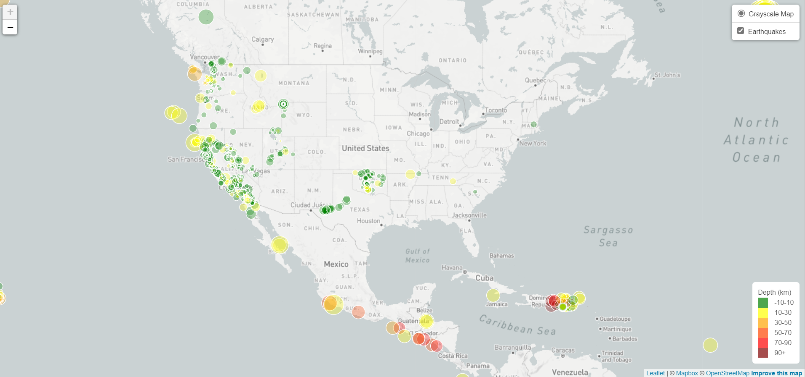

# Visualizing Data with Leaflet

## Background

The United States Geological Survey, or USGS for short, is responsible for providing scientific data about natural hazards, the health of our ecosystems and environment, and the impacts of climate and land-use change. Their scientists develop new methods and tools to supply timely, relevant, and useful information about the Earth and its processes. 

The USGS is interested in building a new set of tools that will allow them to visualize their earthquake data. They collect a massive amount of data from all over the world each day, but they lack a meaningful way of displaying it. Their hope is that being able to visualize their data will allow them to better educate the public and other government organizations (and hopefully secure more funding) on issues facing our planet.

## Project Instructions

The project consists of two parts: 

* Part 1: Create the Earthquake Visualization 

* Part 2: Gather and Plot More Data (Optional)

## Part 1: Create the Earthquake Visualization

### 1. Get the data set

    *   The USGS provides earthquake data in a number of different formats, updated every 5 minutes
    *   The "All Earthquakes from the Past 7 Days" data set was selected from the USGS GeoJSON Feed page
    *   The data was given in JSON format which was used to pull in the data for the visualization

### 2. Import and visualize the data

   * Using Leaflet, created a map that plots all the earthquakes from the dataset based on their longitude and latitude.

       *  The data markers reflected the magnitude of the earthquake by their size and the depth of the earthquake by color. Earthquakes with higher magnitudes should appear larger, and earthquakes with greater depth should appear darker in color.

       * Included popups that provide additional information about the earthquake when its associated marker is clicked.

       * Created a legend that will provide context for the map data.

## Part 2: Gather and Plot More Data (Optional)

Plot a second dataset on the map to illustrate the relationship between tectonic plates and seismic activity. Pull in [Tectonic Plates data set](https://raw.githubusercontent.com/fraxen/tectonicplates/master/GeoJSON/PB2002_boundaries.json").

Here is the screenshot of the map with tectonic plates and earthquakes:

Performed the following tasks: 

* Plotted the tectonic plates dataset on the map in addition to the earthquakes.

* Added other base maps to choose from.

* Put each dataset into separate overlays that can be turned on and off independently.

* Added layer controls to the map.